# FAANG/MAANG Interview Prep — Visual Architecture (Mermaid Diagrams)

> Open this file in VS Code with a Mermaid preview extension or draw.io to see all diagrams rendered visually.

---

## 1. High-Level System Architecture

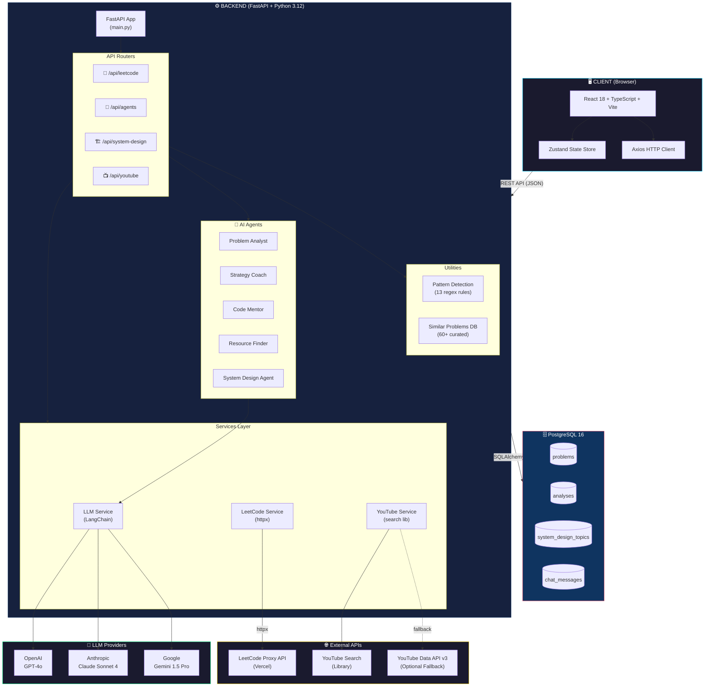

---

## 2. Multi-Agent Pipeline (Sequential Flow)

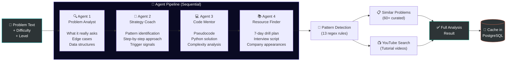

---

## 3. System Design Analysis Flow

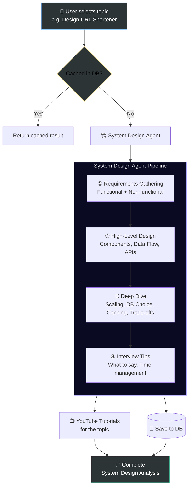

---

## 4. Database Entity Relationship Diagram

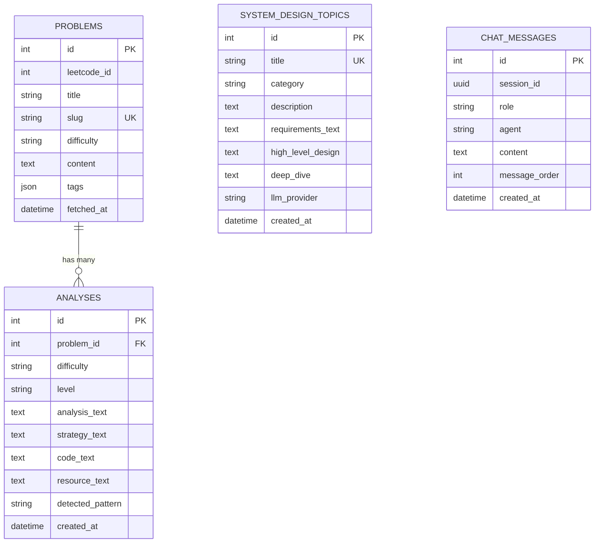

---

## 5. Frontend Component Tree

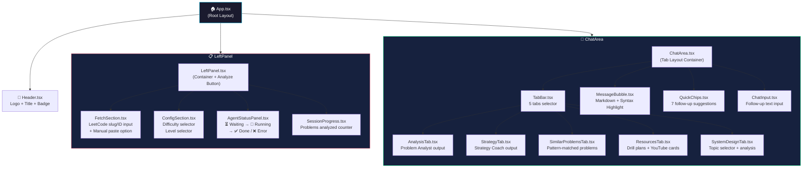

---

## 6. Technology Stack Overview

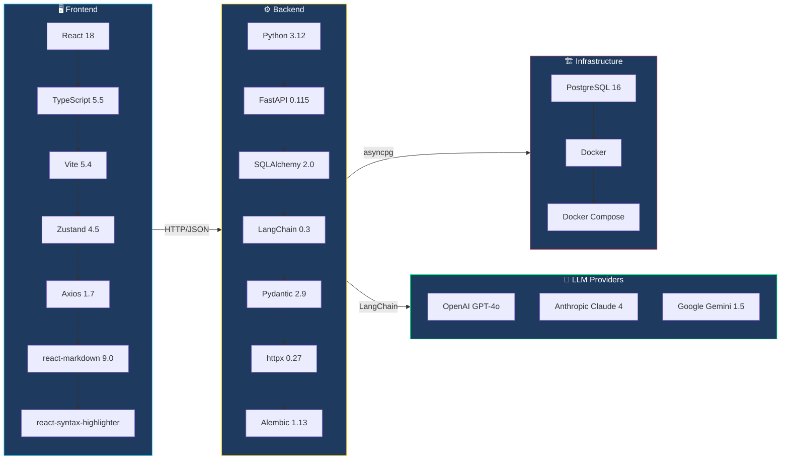

---

## 7. API Request Flow (Sequence Diagram)

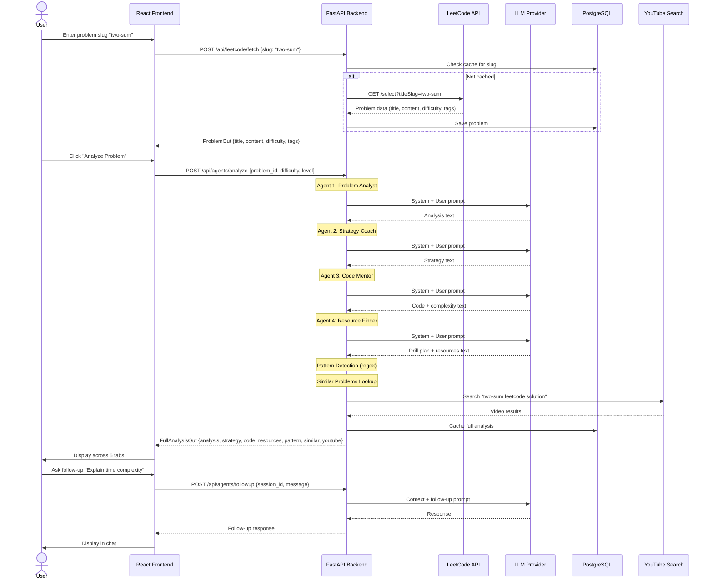

---

## 8. LLM Provider Abstraction

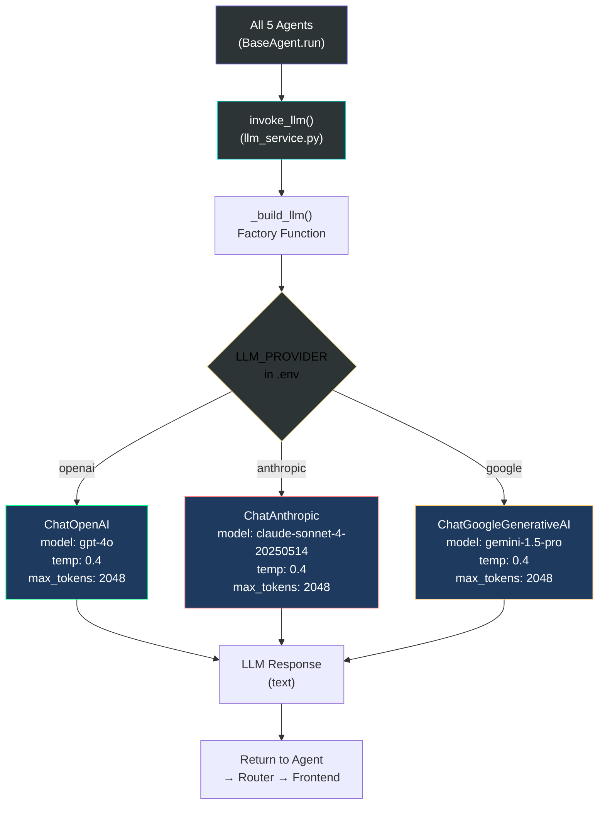

---

## 9. Docker Compose Architecture

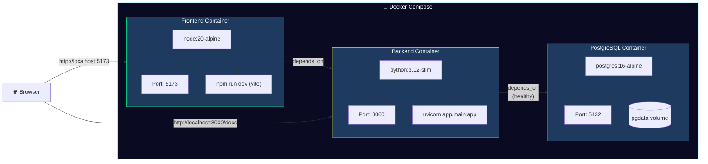

---

## 10. Cloud Deployment Architecture (AWS)

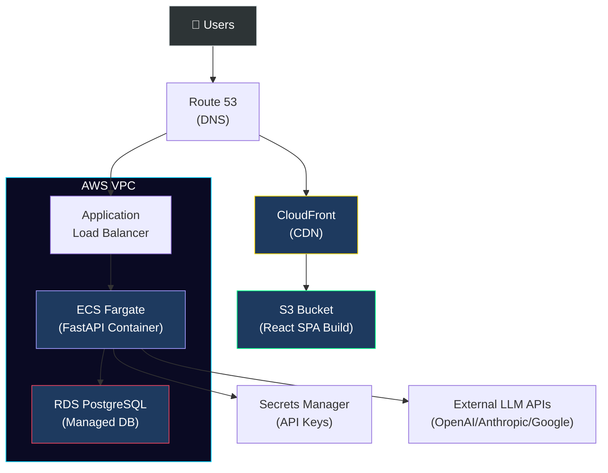

---

## 11. Future Enhancement Roadmap

```mermaid
flowchart LR
    subgraph PHASE1["🟢 Phase 1: Core"]
        direction TB
        P1A["Streaming SSE\nResponses"]
        P1B["JWT Auth\n(Google/GitHub OAuth)"]
        P1C["Spaced\nRepetition"]
        P1D["Problem\nBookmarking"]
        P1E["Light/Dark\nTheme Toggle"]
    end

    subgraph PHASE2["🟡 Phase 2: Advanced"]
        direction TB
        P2A["Code Execution\nSandbox (Judge0)"]
        P2B["Mock Interview\nMode (Timed)"]
        P2C["Progress\nDashboard"]
        P2D["Collaborative\nStudy Groups"]
        P2E["Behavioral\nInterview Prep"]
    end

    subgraph PHASE3["🔴 Phase 3: Scale"]
        direction TB
        P3A["Weakness\nDetection AI"]
        P3B["Company-Specific\nPrep Paths"]
        P3C["Multi-Language\nSolutions"]
        P3D["Voice Interview\nPractice"]
        P3E["Mobile App\n(React Native)"]
        P3F["RAG-Enhanced\nAgents"]
    end

    PHASE1 --> PHASE2 --> PHASE3

    style PHASE1 fill:#1e3a5f,stroke:#00ff88,color:#fff
    style PHASE2 fill:#1e3a5f,stroke:#ffd700,color:#fff
    style PHASE3 fill:#1e3a5f,stroke:#e94560,color:#fff
```

---

## 12. Pattern Detection Categories

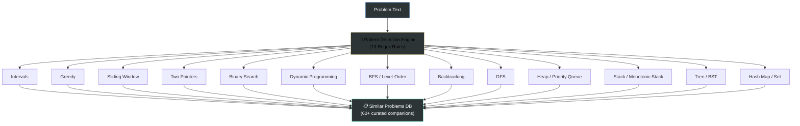

---

## How to View These Diagrams

1. **VS Code** — Install "Markdown Preview Mermaid Support" or "Mermaid Markdown Syntax Highlighting" extension
2. **draw.io** — Open `.md` file in draw.io which supports Mermaid rendering
3. **GitHub** — Push to GitHub, it renders Mermaid natively in `.md` files
4. **Mermaid Live Editor** — Copy any diagram block to [mermaid.live](https://mermaid.live)

---

*Built with FastAPI, React, LangChain, and PostgreSQL. Powered by multi-agent AI coaching.*
