# FAANG Interview Prep Coach — Architecture & Flow Diagrams

> All diagrams below use [Mermaid](https://mermaid.js.org/) syntax. View them in GitHub, VS Code (with Mermaid extension), or any Mermaid-compatible renderer.

---

## 1. High-Level System Architecture

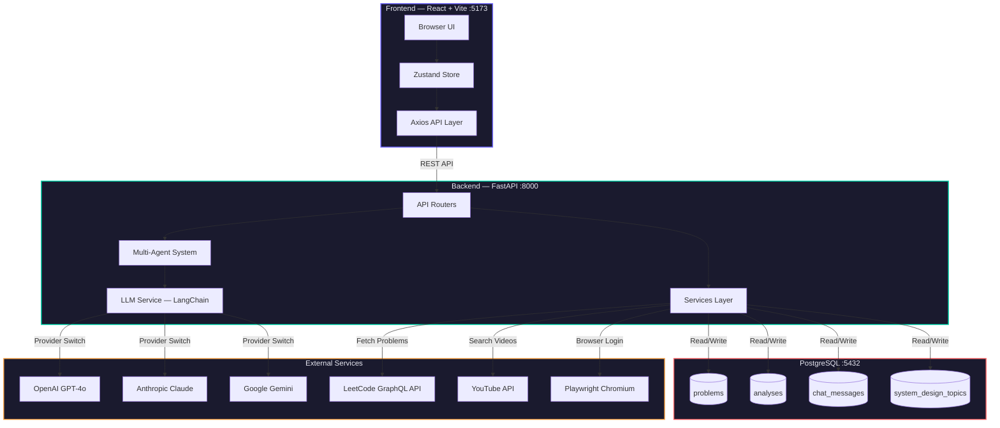

---

## 2. Multi-Agent AI Pipeline

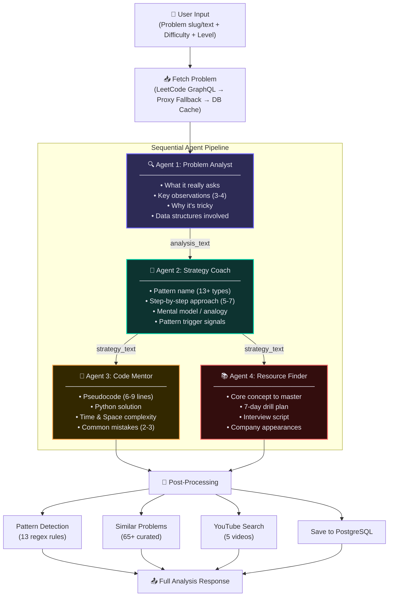

---

## 3. User Journey — Problem Analysis

```mermaid
sequenceDiagram
    actor User
    participant FE as Frontend (React)
    participant Store as Zustand Store
    participant BE as Backend (FastAPI)
    participant LC as LeetCode API
    participant LLM as LLM Provider
    participant DB as PostgreSQL
    participant YT as YouTube

    Note over User,YT: Phase 1 — Fetch Problem
    User->>FE: Enter "two-sum" + click Fetch
    FE->>Store: setFetchStatus("loading")
    FE->>BE: POST /api/leetcode/fetch
    BE->>DB: Check cache (problems table)
    alt Cache Hit
        DB-->>BE: Return cached problem
    else Cache Miss
        BE->>LC: GraphQL query
        LC-->>BE: Problem data
        BE->>DB: Store in problems table
    end
    BE-->>FE: ProblemOut (title, difficulty, tags, content)
    FE->>Store: setFetchedProblem(data)

    Note over User,YT: Phase 2 — AI Analysis
    User->>FE: Select level + click "Analyze"
    FE->>Store: setBusy(true), resetAgents()
    FE->>BE: POST /api/agents/analyze

    rect rgb(45, 43, 85)
        Note over BE,LLM: Agent 1 — Problem Analyst
        BE->>LLM: System prompt + problem text
        LLM-->>BE: analysis_text
    end

    rect rgb(13, 51, 48)
        Note over BE,LLM: Agent 2 — Strategy Coach
        BE->>LLM: System prompt + problem + analysis
        LLM-->>BE: strategy_text
    end

    rect rgb(51, 40, 0)
        Note over BE,LLM: Agent 3 — Code Mentor
        BE->>LLM: System prompt + problem + strategy
        LLM-->>BE: code_text
    end

    rect rgb(51, 13, 13)
        Note over BE,LLM: Agent 4 — Resource Finder
        BE->>LLM: System prompt + problem + strategy
        LLM-->>BE: resource_text
    end

    BE->>BE: Detect pattern + find similar problems
    BE->>YT: Search tutorial videos
    YT-->>BE: 5 video results
    BE->>DB: Store analysis in analyses table
    BE-->>FE: FullAnalysisOut

    FE->>Store: setAnalysisResult(data)
    FE->>Store: Agent statuses → done ✓
    Store-->>User: Results in 6 tabs

    Note over User,YT: Phase 3 — Follow-up Chat
    User->>FE: "Show brute force first"
    FE->>BE: POST /api/agents/followup
    BE->>LLM: Context + question + history
    LLM-->>BE: Coach reply
    BE->>DB: Store in chat_messages
    BE-->>FE: FollowUpResponse
    FE->>Store: addMessage(reply)
    Store-->>User: Reply in Analysis tab
```

---

## 4. System Design Flow

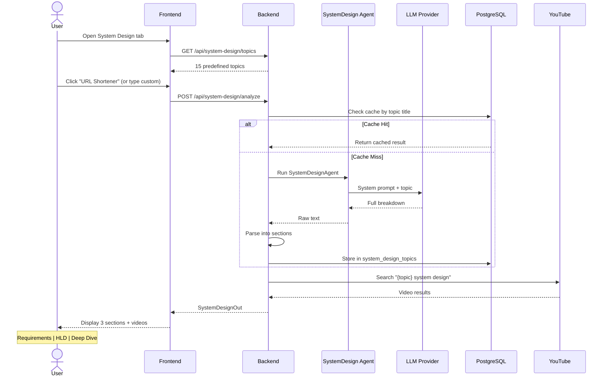

---

## 5. LeetCode Account Connection

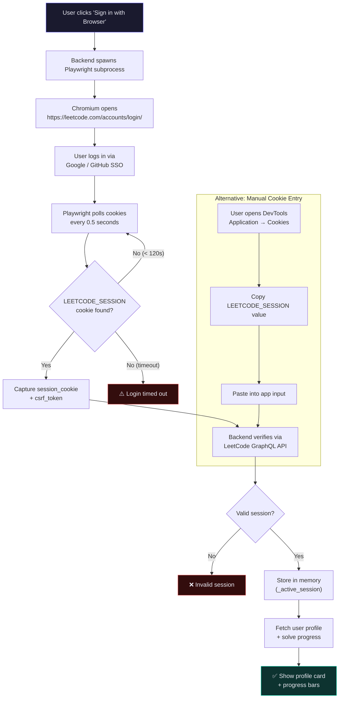

---

## 6. LLM Provider Architecture

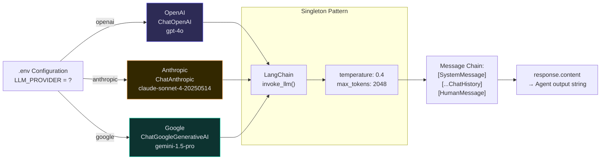

---

## 7. Frontend Component Tree

```mermaid
graph TD
    App["App.tsx"]

    App --> Header["Header.tsx\n⚡ LeetCode Multi-Agent Coach"]
    App --> LP["LeftPanel.tsx\n(265px sidebar)"]
    App --> CA["ChatArea.tsx\n(main content)"]

    LP --> LCC["LeetCodeConnect.tsx\n🌐 Browser login / manual cookie"]
    LP --> FS["FetchSection.tsx\n📥 Slug input + fetch button"]
    LP --> CS["ConfigSection.tsx\n⚙️ Level selector"]
    LP --> AB["[Analyze Button]\n🚀 Triggers 4-agent pipeline"]
    LP --> ASP["AgentStatusPanel.tsx\n🔍🎯🐍📚 Status indicators"]
    LP --> SP["SessionProgress.tsx\n📊 Problems analyzed counter"]

    CA --> TB["TabBar.tsx\n6 tabs"]
    CA --> AT["AnalysisTab.tsx\n💬 Chat messages"]
    CA --> ST["StrategyTab.tsx\n🎯 Strategy output"]
    CA --> CT["CodeTab.tsx\n🐍 Python solution + copy"]
    CA --> SPT["SimilarProblemsTab.tsx\n🔗 Pattern + related problems"]
    CA --> RT["ResourcesTab.tsx\n📚 YouTube + resources"]
    CA --> SDT["SystemDesignTab.tsx\n🏗️ 15 topics + analysis"]
    CA --> QC["QuickChips.tsx\n💡 Pre-built questions"]
    CA --> CI["ChatInput.tsx\n✏️ Follow-up input"]

    AT --> MB["MessageBubble.tsx\n🗨️ Individual message"]
    RT --> Loader["Loader.tsx\n⏳ Bouncing dots"]
    SDT --> Loader

    style App fill:#1a1a2e,stroke:#6c63ff,stroke-width:2px,color:#e8e8f2
    style LP fill:#1a1a2e,stroke:#6c63ff,color:#e8e8f2
    style CA fill:#1a1a2e,stroke:#00d4aa,color:#e8e8f2
```

---

## 8. Database Entity Relationship

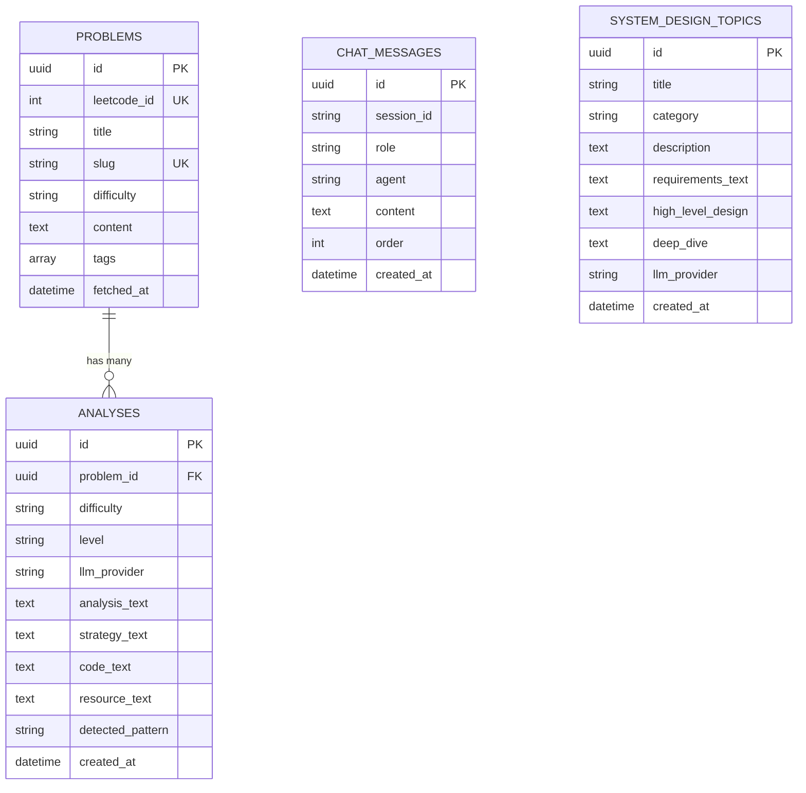

---

## 9. API Route Map

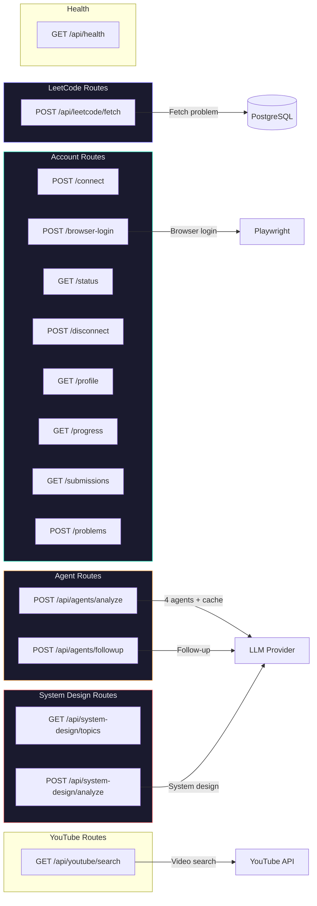

---

## 10. Pattern Detection & Similar Problems

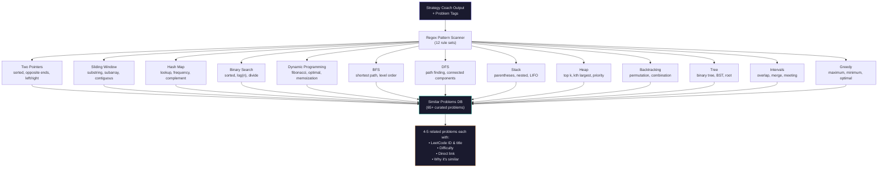

---

## 11. Data Flow — Zustand Store

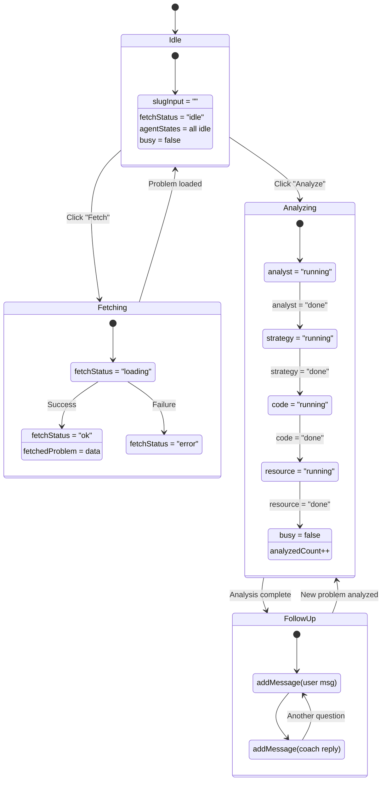

---

## 12. Docker Compose Services

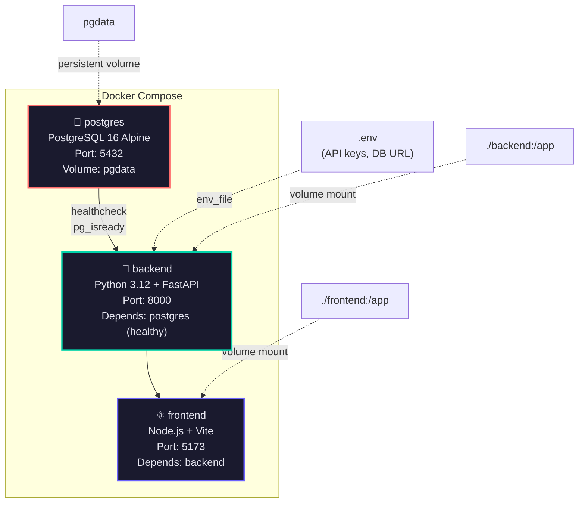
